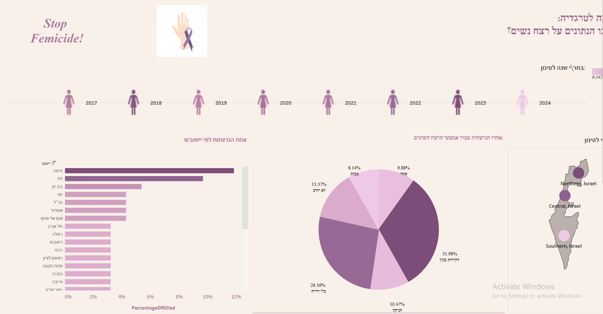
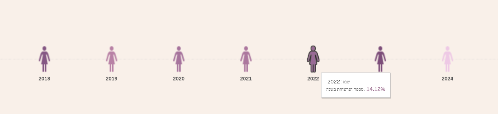
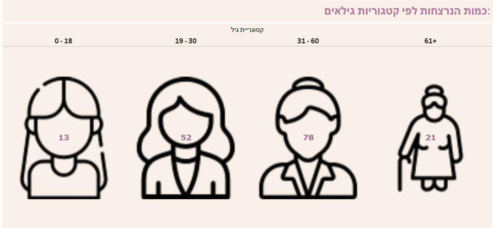

# Femicide Data Dashboard (Israel, 2017–2024)

An interactive Tableau dashboard analyzing femicide (gender-related homicides) in Israel between 2017 and 2024.  
This project was developed as part of the **Data Visualization & Cognition** course.

## 🔗 Live Demo
- [View on Tableau Public](https://public.tableau.com/views/Team44Project/Dashboard1?:language=en-US&publish=yes&:sid=&:redirect=auth&:display_count=n&:origin=viz_share_link)

## 🧭 Project Overview
- Packaged Tableau workbook: `Femicide Data Dashboard.twbx`
- Supplementary documentation (Hebrew): `Femicide Data Dashboard – Visual Analytics.pdf`
- Data sources: public datasets on femicide cases (2017–2024), unemployment rates, and firearm license approvals.

## ⚙️ How to Open
### Option 1 – Quick Preview
- Visit the [Tableau Public link](https://public.tableau.com/views/Team44Project/Dashboard1?:language=en-US&publish=yes&:sid=&:redirect=auth&:display_count=n&:origin=viz_share_link) for an interactive online demo.

### Option 2 – Local (Recommended for recruiters/portfolio)
1. Install **Tableau Reader** (free) or use Tableau Desktop if available.
2. Download the file `Femicide Data Dashboard.twbx`.
3. Open it locally and explore filters (year, region, city) for interactive insights.

## 🧾 Data Sources (examples)
- **Femicide incidents (2017–2024):** 172 rows, 26 attributes.  
- **Unemployment rates by gender:** 23 rows × 3 columns.  
- **Approved firearm licenses (per year):** 7 rows × 3 columns.  
*(See `Femicide Data Dashboard – Visual Analytics.pdf` for details)*

## 🧪 Data Preparation
- Extracted structured variables from unstructured case descriptions (e.g., relationship to perpetrator, city, age, ethnicity, method of killing).
- Manually grouped rare categories under "Other".
- Added calculated fields (`NumberOfOccurrences`, `PercentageOfKilled`) to normalize values across charts.

## ✨ Dashboard Features
- Geographic, yearly, and city-level filtering.
- Trends over time: firearm license approvals, unemployment, homicide rates.
- Combination of maps, pie charts, bar charts, line charts, and tooltips.

## 📸 Screenshots

### Dashboard Overview

### Yearly Trends

### Victims by Age Category

## 🔒 License
This repository is released under the MIT License (see `LICENSE`).
